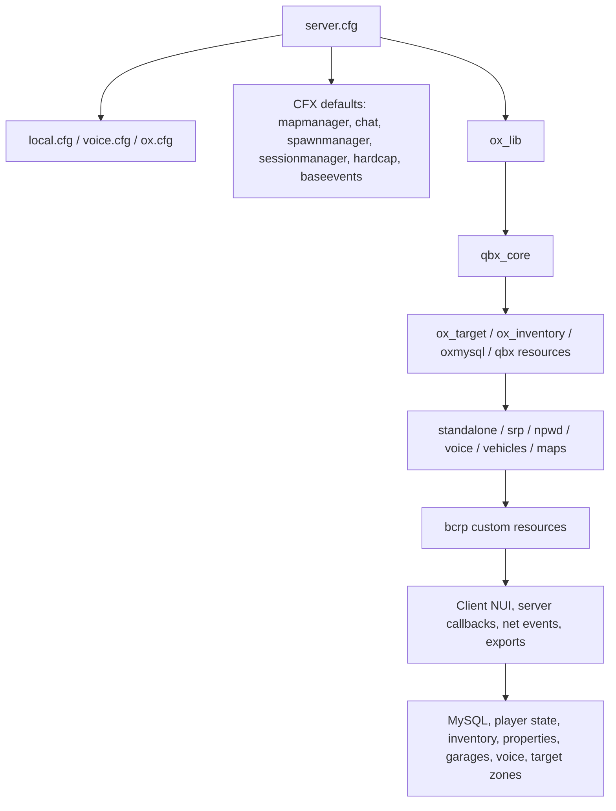

# BrokenCompassRP Architecture

Repository: `BrokenCompass-RP/BrokenCompassRP`  
Inspected commit: `b8ab322efbfe8fdbc310d3d17e4decd63ce85e18` on `main`  
Date: 2026-06-27

## Executive Summary

BrokenCompassRP is a FiveM/Qbox server-data repository. It combines root FXServer configuration, database artifacts, custom Broken Compass RP scripts, upstream framework resources, third-party standalone systems, paid/escrowed entitlement assets, maps, vehicles, voice, and phone integrations.

The runtime spine is:

1. `server.cfg` loads local/private config, `voice.cfg`, Qbox convars, Ox convars, core CFX defaults, then grouped resources.
2. `ox_lib`, `qbx_core`, `ox_target`, `ox_inventory`, `oxmysql`, and `qbx_properties` provide the shared service layer.
3. Custom BCRP resources add staff tools, property tooling, player-count UI, quest-hint NPCs, ambient emergency-radio audio, ped clearing, and vehicle spotlight sync.
4. Vendor systems provide gameplay jobs, phone, dispatch, MDT, voice/radio, maps, interiors, vehicles, inventory, doorlocks, weather, appearance, prison, emotes, banking, and minigames.

The repo is asset-heavy: 9,085 tracked paths, roughly 2,914 text/config/script-ish files, and many binary map/vehicle/audio/image/database files.

## Root Runtime Files

- `server.cfg`: main orchestration file. Defines endpoints, server max clients, tags, icon, local includes, Qbox settings, NPWD tokens, loadscreen colors, grouped `ensure` ordering, admin principals, BCRP ACE permissions, and misc config inclusion.
- `voice.cfg`: pma-voice convars. Enables native audio, sending-range-only voice, UI, proximity cycling, radio/call support, submix, radio animation, default radio key, and refresh rate.
- `ox.cfg`: Ox Lib, Ox Target, and Ox Inventory convars. Sets locale, target behavior, inventory framework as `qbx`, inventory slots/weight, police jobs, image path, logging, random loot, evidence grade, and synced accounts.
- `permissions.cfg`: server permission definitions loaded by `server.cfg`.
- `misc.cfg`: miscellaneous convars/commands loaded at the end of `server.cfg`.
- `local.cfg` and `local-resources.cfg`: expected local-only files, intentionally not committed according to README/server config usage.
- `README.md`: setup instructions requiring current FXServer artifacts plus MariaDB 11.6+ or MySQL 8+ and a DB backup.
- `db/default/*` and `hypnonema.db`: committed runtime database artifacts. These are not source code and should be treated carefully.

## Custom Resources

The custom namespace is `resources/[bcrp]`.

| Resource | Purpose | Dependencies / Integrations |
|---|---|---|
| `bcrp-admintools` | Modular staff tools. Currently centered on story spawning. | `ox_lib`, optional `qbx_core` permission checks, ACE permissions, optional `LegacyFuel` export. |
| `bcrp-ambient-radio` | Client-side ambient muffled dispatch/scanner audio from emergency vehicles. | `ox_lib`, NUI page with OGG audio assets. |
| `bcrp-pedclear` | Clears peds/vehicles inside configured PD zones. | `ox_lib`. |
| `bcrp-playercount` | NUI HUD for total/police/fire/EMS-style counts. | `qbx_core`, `ox_lib`, QBCore-compatible events. |
| `bcrp-propertytools` | Admin/dev tooling for qbx_properties apartment batches, property maintenance, and routing buckets. | `ox_lib`, `oxmysql`, `qbx_properties`, `qbx_core`, `qbx_garages`, ACE. |
| `bcrp-quest-hints` | Moving NPCs that provide hints and optional fence selling behavior. | `ox_lib`, `ox_target`, `ox_inventory`, `qbx_core`, NUI dialogue. |
| `bcrp-spotlight` | Synced vehicle spotlight system for emergency/utility use. | `ox_lib`, `qbx_core`, network entity events. |
| `qbx_police` | BCRP-maintained police fork retaining its upstream runtime name for compatibility. | `qbx_core`, `ox_lib`, `oxmysql`, `ox_inventory`, `bcrp-forensics`; stored at `resources/[bcrp]/qbx_police`. |

### BCRP Event Flow

- `bcrp-admintools`
  - Client calls `lib.callback.await('bcrp-admintools:server:hasPermission')`.
  - Server checks ACE, configured identifiers, and Qbox permissions.
  - Story spawn actions log with `bcrp-admintools:server:storyspawn:logSpawn` and `logDelete`.
  - Server can trigger `bcrp-admintools:client:storyspawn:openMenu`.

- `bcrp-propertytools`
  - Commands trigger client wizard/maintenance events.
  - Client submits property mutations to server events such as `createApartmentBuilding`, `cloneProperty`, `renumberApartments`, `deleteProperty`, `renameProperty`, `moveEntrance`, and `moveGarage`.
  - Server writes to the `properties` table using `oxmysql`.
  - Server notifies `qbx_properties:client:addProperty` after additions/moves.
  - Server listens to `qbx_properties:server:enterProperty` and `exitProperty` to place/reset players into routing buckets.
  - Exports: `ResetBucket`, `SetPropertyBucket`, `GetActiveBucket`.

- `bcrp-playercount`
  - Client requests counts with `bcrp:playercount:server:requestCounts`.
  - Server recalculates on player load/unload, join/drop, job updates, and duty changes.
  - Server broadcasts `bcrp:playercount:client:update`.
  - Backward-compatible aliases exist under `bc_playercount:*`.

- `bcrp-quest-hints`
  - Server initializes NPC locations and randomized fence prices on resource start.
  - Client requests sync with `bcrp-quest-hints:server:requestSync`.
  - Server broadcasts `client:setNpcLocation`.
  - Client uses `ox_target` to interact with local NPC entities.
  - Dialogue and sellable items are fetched by `lib.callback`.
  - Client submits sales with `server:sellItem`; server validates proximity, item allowlist, inventory count, removes item, and adds money.
  - Police proximity detection sends `server:policeDetected`; server broadcasts `client:fleeNpc`.

- `bcrp-spotlight`
  - Client toggles/updates spotlight state via `srp-spotlight:server:toggle` and `server:update`.
  - Server stores active spotlights by network entity and owner.
  - Server syncs with `client:syncAll`, `client:add`, `client:update`, and `client:remove`.
  - Player disconnect cleanup removes owned spotlights.

## Vendor Resources

These resources are manifest-backed and should be treated as vendor/framework/asset resources unless the team has intentionally forked them.

### CFX Defaults

`resources/[cfx-default]/[gamemodes]/[maps]/fivem-map-hipster`, `fivem-map-skater`, `redm-map-one`; `resources/[cfx-default]/[gamemodes]/basic-gamemode`; examples `money-fountain-example-map`, `money-fountain`, `money`, `ped-money-drops`; gameplay `chat-theme-gtao`, `player-data`, `playernames`; managers `mapmanager`, `spawnmanager`; system builders `webpack`, `yarn`; system resources `baseevents`, `hardcap`, `rconlog`, `runcode`, `sessionmanager-rdr3`, `sessionmanager`; test resources `example-loadscreen`, `fivem`.

### Entitlements / Paid Assets

`cfx-gabz-vbmarket`, `fiv3devs_mapdata`, `fiv3devs_vespucci`, `nw_bahamaMama`, `prompt_vfd_4bays`, `qua_delperroproject`, `wxmaps_commons`, `wxmaps_lshospital`, `wxmaps_lshospital_v`.

Most depend on `/assetpacks`; `wxmaps_lshospital` also depends on `wxmaps_commons` and `wxmaps_lshospital_v`.

### Maps / Interiors / Shells / YMAPs

Maps: `Meetingroomprison`, `Prisoncanteen`, `Prisonmainblock`, `SLBK11_MissionRow`, `beach_garage`, `correct_signs`, `dealer_map`, `int_arcade`, `marlonstudio_sandypawn`, `moreo_taco`, `otto_paleto_firestation`, `paletopd`, `pd_sandy`, `vortex_phonestore`.

Shells: `K4MB1-StarterShells`.

YMAPs: `srp_ymaps`.

### Ox Stack

`elevators`, `ox_doorlock`, `ox_fuel`, `ox_inventory`, `ox_lib`, `ox_target`, `oxmysql`.

Core provides callbacks, UI helpers, target zones, inventory, door state, fuel, and database access. `ox_target` provides `qtarget`; `oxmysql` provides `mysql-async` and `ghmattimysql`.

### Qbox Stack

`qbx_adminmenu`, `qbx_bankrobbery`, `qbx_binoculars`, `qbx_busjob`, `qbx_carwash`, `qbx_chat_theme`, `qbx_cityhall`, `qbx_core`, `qbx_customs`, `qbx_density`, `qbx_divegear`, `qbx_diving`, `qbx_drugs`, `qbx_fireworks`, `qbx_garages`, `qbx_garbagejob`, `qbx_houserobbery`, `qbx_hud`, `qbx_idcard`, `qbx_jewelery`, `qbx_management`, `qbx_mechanicjob`, `qbx_newsjob`, `qbx_pawnshop`, `qbx_properties`, `qbx_radialmenu`, `qbx_recyclejob`, `qbx_scrapyard`, `qbx_seatbelt`, `qbx_smallresources`, `qbx_spawn`, `qbx_storerobbery`, `qbx_taxijob`, `qbx_towjob`, `qbx_truckerjob`, `qbx_truckrobbery`, `qbx_vehiclekeys`, `qbx_vehicles`, `qbx_vehiclesales`, `qbx_vehicleshop`, `qbx_vineyard`, `qbx_weed`.

Several provide QB compatibility names: `qbx_core` provides `qb-core`; `qbx_mechanicjob` provides `qb-mechanicjob`; `qbx_scrapyard` provides `qb-scrapyard`; `qbx_taxijob` provides `qb-taxijob`; `qbx_towjob` provides `qb-towjob`; `qbx_truckerjob` provides `qb-truckerjob`; `qbx_vehiclekeys` provides `qb-vehiclekeys`.

### Phone / NPWD

`resources/[npwd]/npwd`, `resources/[npwd]/qbx_npwd`, `resources/[npwd-apps]/npwd_qbx_garages`, `resources/[npwd-apps]/npwd_qbx_mail`.

`server.cfg` sets `npwd:framework` to `qbx` and provides screenshot/audio tokens. The qbx adapter provides `qb-npwd`; app resources provide QB-compatible garage/mail names.

### SRP

`srp-arcade`, `srp-firescript`, `srp-props`, `srp-rptools`, `srp-vehiclecontrols`, `srp-welcomehome`.

These are gameplay/UI utilities integrated with Ox/Qbox. `srp-rptools` declares client exports.

### Standalone

`1v_changelivery`, `MugShotBase64`, `Renewed-Banking`, `Renewed-Weathersync`, `bob74_ipl`, `bridge_tester`, `citra-taxi`, `citra_bridge`, `d3-arcade`, `discordwebhooks`, `firehose`, `firehosemodels`, `illenium-appearance`, `informational`, `it-drugs`, `it_bridge`, `jim-boarding`, `jim-trains`, `jim_bridge`, `kq_link`, `kq_propplacer`, `loadscreen`, `lux_vehcontrol`, `mana_audio`, `mhacking`, `ps-dispatch`, `ps-mdt`, `qs-tutorial`, `randol_medical`, `randol_prescriptions`, `randol_pulsecheck`, `safecracker`, `screencapture`, `screenshot-basic`, `scully_beachmarket`, `scully_emotemenu`, `stretcher`, `ultra-voltlab`, `vehiclehandler`, `vertex-hub`, `wasabi_fishing`, `wk_wars2x`, `wm-serversirens`, `xsound`, `xt-prison`.

Important provides: `Renewed-Banking` provides `qb-management` and `esx_society`; `Renewed-Weathersync` provides `qb-weathersync` and `cd_easytime`.

### Vehicles

`civ_vehicles`, `fire_vehicles`, `nkterminus`, `noisiak_variouspack`, `noisiak_variouspack/data/nkseashark2`, `onx-polscout`, `onx_vehicles`, `police_vehicles`, `police_vehicles/data/nkcruiser`.

These are mostly stream/data resources with vehicle metadata, models, liveries, and handling files. Several depend on `/assetpacks`.

### Voice

`pma-voice`, `qbx_radio`.

`pma-voice` provides voice, radio, call, proximity, mute, and channel exports. `qbx_radio` depends on `pma-voice`, integrates with `ox_inventory:itemCount`, and exports `IsRadioOn`.

## Dependencies

### Platform

- FiveM FXServer, current artifact recommended by README.
- GTA5 game target in most manifests.
- OneSync managed through txAdmin settings; some resources declare `/onesync`.
- MariaDB 11.6+ or MySQL 8+.

### Core Runtime Dependencies

- `ox_lib`: callbacks, context menus, notifications, input dialogs, progress, locale, cache/init globals.
- `oxmysql`: async MySQL API.
- `qbx_core`: players, groups/jobs/gangs, permissions, money, usable items, QB bridge, player lifecycle.
- `ox_inventory`: items, stashes, shops, money/item mutation, inventory UI.
- `ox_target`: entity/zone interaction targeting.
- `qbx_properties`: property table/runtime, property enter/exit events.
- `qbx_garages`: garage registration/export used by BCRP property tools.
- `pma-voice`: voice/radio/call substrate.
- `npwd`: phone runtime.

### JavaScript / UI Dependencies

- `qbx_properties`: `@citizenfx/server`, `image-js`, `webp-converter`.
- `ps-dispatch/ui`: Vite, Svelte 3, Tailwind, DaisyUI, Leaflet, Lucide, TypeScript.
- `pma-voice/voice-ui`: Vue 3, Vue CLI 4, core-js.
- CFX webpack builder: webpack 4, async, worker-farm.
- CFX sessionmanager-rdr3: `@citizenfx/protobufjs`.

## Exports

Custom BCRP exports:

- `bcrp-propertytools`: `ResetBucket(source)`, `SetPropertyBucket(source, propertyId)`, `GetActiveBucket(source)`.

Major shared/vendor exports include:

- `qbx_core`: player lookup, permissions, usable items, groups, jobs/gangs, money, metadata, vehicle helpers, QB bridge exports.
- `ox_inventory`: `AddItem`, `RemoveItem`, `GetItemCount`, `GetInventoryItems`, `Items`, stash/shop registration, hooks, open/close inventory helpers.
- `ox_target`: add/remove target zones/entities and qtarget-compatible surface.
- `ox_doorlock`: door lookup/edit/state exports.
- `oxmysql`: MySQL API and compatibility provides.
- `pma-voice`: radio/call/proximity/mute exports and server channel helpers.
- `qbx_radio`: `IsRadioOn`.
- `ps-dispatch`: many alert exports including robbery, shooting, vehicle theft, officer down, EMS down, and custom alerts.
- `xsound`: positional/dynamic audio play, manipulation, info, and event exports.
- `scully_emotemenu`: emote/walk/expression/menu exports.
- `xt-prison`: jail-time/lifer exports.
- `mana_audio`: sound playback exports.

## Shared Libraries And Cross-Cutting Patterns

- `@ox_lib/init.lua` is the dominant shared Lua bootstrap.
- `@qbx_core/modules/lib.lua` and `@qbx_core/modules/playerdata.lua` are used throughout Qbox and dependent resources.
- `@oxmysql/lib/MySQL.lua` is the server-side DB bridge.
- QBCore-compatible events remain important even with Qbox enabled, for example `QBCore:Client:OnPlayerLoaded`, `QBCore:Server:OnPlayerLoaded`, job update, duty update, and unload events.
- NUI pages are used by BCRP player count, quest hints, ambient radio, HUD, radio, phone, inventory, doorlock, dispatch, MDT, loadscreen, and multiple minigames.
- Grouped `ensure` blocks in `server.cfg` are the primary dependency ordering mechanism.

## High-Level Event Flow



Typical runtime loops:

- Player connects: CFX/sessionmanager/qbx_core create player state, qbx resources emit QBCore/Qbox lifecycle events, BCRP player count recalculates, phone/radio/inventory initialize.
- Interaction: client target/NUI invokes callbacks or server events, server validates against Qbox player state/ACE/proximity/inventory, then mutates DB/player/inventory and broadcasts updates.
- Property entry: qbx_properties emits enter/exit events; BCRP property tools moves player routing bucket and watchdog resets stray interior state.
- Voice/radio: qbx_radio NUI/item state calls pma-voice exports/events to join/leave/talk on channels.
- Dispatch/MDT/crime jobs: Qbox/standalone crime resources trigger ps-dispatch/MDT and inventory/money side effects.

## Potential Technical Debt

1. Secrets appear committed in `server.cfg`: `SCREENSHOT_BASIC_TOKEN` and `NPWD_AUDIO_TOKEN`. Move to untracked `local.cfg` or environment-specific deployment config.
2. Runtime database artifacts are committed: `db/default/*` and `hypnonema.db`. This risks state drift, binary churn, and accidental data exposure.
3. The repository vendors many upstream/third-party resources directly. Updating, auditing, and distinguishing local modifications from upstream becomes difficult.
4. Asset-heavy resources make cloning slow and brittle. Consider Git LFS or separating binary assets into deployment artifacts.
5. `server.cfg` has duplicate `ensure [shell]` and broad grouped ensures. This can hide ordering bugs and makes startup reasoning harder.
6. Some BCRP naming is mixed with `srp-*` event names in `bcrp-spotlight`, which may confuse ownership and grep-based maintenance.
7. QBCore compatibility and Qbox-native patterns are mixed. This is common in Qbox servers, but boundaries should be documented per resource.
8. BCRP custom modules share patterns but do not share a common BCRP utility library for permission checks, notifications, logging, config validation, and proximity validation.
9. Some user-facing config text has typos and hardcoded story content in Lua config. Moving narrative data to data files would make content iteration safer.
10. No obvious test, lint, or validation workflow is present at repo root. Resource manifest validation, config linting, and forbidden-secret checks would pay off quickly.

## Recommended Project Structure

Recommended target shape:

```text
server-data/
  README.md
  server.cfg
  cfg/
    voice.cfg
    ox.cfg
    permissions.cfg
    misc.cfg
    local.cfg.example
    local-resources.cfg.example
  resources/
    [bcrp]/
      bcrp_lib/
      bcrp-admintools/
      bcrp-propertytools/
      bcrp-quest-hints/
      bcrp-playercount/
      bcrp-ambient-radio/
      bcrp-pedclear/
      bcrp-spotlight/
    [framework]/
      ox/
      qbx/
      npwd/
      voice/
    [integrations]/
      standalone/
      srp/
    [assets]/
      maps/
      vehicles/
      entitlements/
      ymaps/
      shells/
  docs/
    architecture.md
    resource-catalog.md
    startup-order.md
    event-contracts.md
    operations.md
  scripts/
    validate-manifests.ps1
    scan-secrets.ps1
    list-resources.ps1
  db/
    schema/
    migrations/
    seed/
```

Short-term practical improvements:

- Keep current FiveM bracket folders if deployment tooling depends on them, but add `docs/resource-catalog.md` to declare ownership: custom, framework, vendor, entitlement, asset.
- Create a shared `bcrp_lib` for BCRP permission, notify, logging, callback wrappers, proximity checks, and config validation.
- Move tokens and local-only settings out of committed `server.cfg`.
- Replace committed DB snapshots with schema/migrations and documented seed/import process.
- Add a manifest/resource inventory script so future architecture docs can be regenerated.
- Record local modifications to vendor resources in `docs/vendor-patches.md`.
