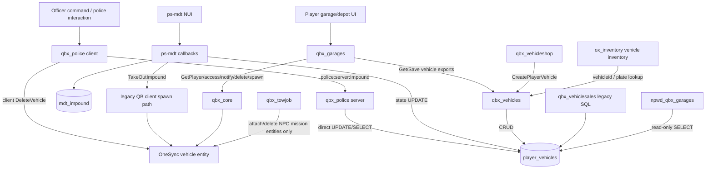

# Broken Compass RP — Vehicle Lifecycle & Impound Architecture Review

Date: 2026-08-01  
Scope: current active workspace under `server-data/resources`; read-only code review (no runtime/database inspection)  
Evidence labels: **Confirmed** means directly established by current code/config. **Inference** means the likely runtime consequence. **Unconfirmed** means runtime state or external behavior was unavailable.

## Executive Summary

The codebase does not currently have a single impound workflow. It has three overlapping interpretations of the same `player_vehicles.state` field:

1. `qbx_garages` treats state `0` (`OUT`) and state `2` (`IMPOUNDED`) as retrievable from depot-type garages. It charges `player_vehicles.depotprice`, then server-spawns the vehicle and writes state `0`.
2. owned `qbx_police` provides two officer actions: a priced “depot” action that deliberately writes state `0` plus `depotprice`, and a “full impound” action that writes state `2`. It also contains a police-only impound lot that lists every state-2 vehicle globally and releases it by writing state `0`.
3. active `ps-mdt` independently writes state `2`, records fee/report/time in `mdt_impound`, and can release by writing state `1`, deleting the impound record, and client-spawning a vehicle through legacy QB garage APIs.

The most important confirmed conflict is that `qbx_garages`' public depot accepts both state `0` and state `2`. Therefore a vehicle marked as a permanent/police impound by either police system is also eligible for ordinary player depot retrieval, subject only to ownership and the `depotprice` column. The MDT fee is stored in `mdt_impound.fee`, but the garage charges `player_vehicles.depotprice`; the two fees are not synchronized. A state-2 MDT impound can consequently appear at the public depot with a zero or stale depot charge.

The desired cleanup philosophy is already partly configured: `qbx_garages.autoRespawn = true` changes every state-0 row to state 1 when `qbx_garages` starts, preserving its existing `garage` value. This is virtual recovery; it does not spawn the vehicle. It runs on a garage resource restart as well as a full server restart. No equivalent owned-vehicle state transition was found on disconnect/reconnect. Core vehicle persistence is explicitly disabled.

Recommended direction: retain the Qbox `player_vehicles` record and `qbx_vehicles` save/spawn primitives; make one owned BCRP adapter the sole writer for lifecycle/impound transitions; reserve state 2 for intentional police holds; stop public depot filtering from treating state 2 as ordinary retrieval; keep MDT impound metadata but deprecate its direct state mutation and spawn/release path. These are narrow, reversible boundary changes rather than a rewrite.

## Current Vehicle Lifecycle

### Lifecycle map

```text
Dealer purchase (qbx_vehicleshop)
  -> qbx_vehicles:CreatePlayerVehicle
  -> player_vehicles row (schema default state=1; garage may be NULL)

Used sale return/purchase (qbx_vehiclesales legacy path)
  -> direct INSERT player_vehicles state=0
  -> OUT, garage unspecified

GARAGED (1, assigned garage)
  -> garage menu filters owner + state + garage
  -> qbx_garages server spawn
  -> owned entity gets state bags isOwned, vehicleid, fuel
  -> SaveVehicle(state=0, calculated depotprice)
  -> OUT (0)

OUT (0)
  -> normal parking at non-depot garage
     -> SaveVehicle(garage, state=1, props/fuel/health)
     -> server qbx_core:DeleteVehicle
     -> GARAGED (1)
  -> qbx_garages resource/server start with autoRespawn=true
     -> bulk SQL state 0 -> 1; garage unchanged
     -> GARAGED (1)
  -> public depot menu (because depot accepts state 0)
     -> pay player_vehicles.depotprice
     -> spawn -> state remains/returns 0 and fee recalculates
     -> OUT (0)
  -> officer priced depot action
     -> write state=0 + fee/damage/fuel
     -> client DeleteVehicle
     -> OUT (0), retrievable at public depot
  -> officer full impound or MDT impound
     -> state=2 (+ damage in qbx_police; + mdt_impound metadata in MDT)
     -> IMPOUNDED (2)
  -> entity deletion by admin/other resource
     -> database normally remains state 0
     -> later depot retrieval or next garage-resource autoRespawn

IMPOUNDED (2)
  -> qbx_garages public depot (currently allowed)
     -> optional depotprice payment -> server spawn -> state=0
  -> qbx_police police impound lot
     -> police server spawn -> client applies props/damage
     -> server event writes state=0
  -> ps-mdt officer release
     -> state=1 + delete mdt_impound row
     -> legacy client spawn at configured impound point
  -> qbx_garages autoRespawn
     -> no change (bulk query changes state 0 only)

Ownership transfer/deletion
  -> qbx_vehicles SetPlayerVehicleOwner, or direct legacy SQL
  -> qbx_vehiclesales/scrap/sale can DELETE player_vehicles
  -> record and garage/impound status cease to exist
```

### Current state definitions

| State | Definition in code | Writers | Readers | Player experience |
|---|---|---|---|---|
| `0` / `OUT` | `qbx_garages/shared/types.lua:3` | Garage spawn; garage restart changes away from it; police priced depot explicitly sets it; police release sets it; legacy vehicle sales inserts it | Public depot filters include it; NPWD labels it `out`; ordinary garages exclude it | Vehicle is considered outside. If entity is absent, player can retrieve at depot; on garage resource restart it silently becomes garaged. |
| `1` / `GARAGED` | `qbx_garages/shared/types.lua:4`; schema default | Normal parking; garage auto-respawn; MDT release; `CreatePlayerVehicle` inherits schema default unless overridden | Normal garage default filter; NPWD labels it `garaged` | Vehicle appears at its assigned garage, assuming `garage` is valid. MDT may simultaneously spawn it while DB says garaged. |
| `2` / `IMPOUNDED` | `qbx_garages/shared/types.lua:5` | `qbx_garages:SetVehicleGarage` when target garage is depot; qbx_police full impound; ps-mdt impound | Qbox depot filters, police impound menu, MDT status, NPWD | Vehicle is shown as impounded, but is also eligible at the general depot. Police can release all state-2 vehicles; owner can likely retrieve through Qbox depot. |

Important implementation detail: `qbx_vehicles`' save-query builder uses truthiness checks. Lua treats `0` as truthy, so state 0 and depotPrice 0 are included correctly. Garage assignment is only written when a non-nil/non-false string is supplied.

### Purchase and ownership paths

- **Confirmed:** `qbx_vehicleshop/server/storage.lua:5-8` creates purchases through `exports.qbx_vehicles:CreatePlayerVehicle`, which inserts `license`, `citizenid`, model/hash/mods/plate and relies on schema defaults for lifecycle fields unless options provide them.
- **Confirmed:** `qbx_vehiclesales/server/main.lua:65` and `:117-124` use legacy direct inserts with state `0`, no garage, and legacy columns. Sold vehicles are directly deleted at `:74`/`:99`.
- **Confirmed:** `qbx_vehicles` owns the canonical CRUD exports: `CreatePlayerVehicle`, `GetPlayerVehicle(s)`, `SaveVehicle`, `SetPlayerVehicleOwner`, `DeletePlayerVehicles`, and `GetVehicleIdByPlate`.
- **Confirmed:** `ox_inventory` does not change vehicle ownership or lifecycle state. Its Qbox bridge resolves a vehicle inventory identity from entity state `vehicleid` or `qbx_vehicles:GetVehicleIdByPlate` (`modules/bridge/qbx/server.lua:105-106`). Trunk/glovebox storage is therefore identity-dependent but not an impound authority.
- **Confirmed:** `npwd_qbx_garages` is read-only for lifecycle: it queries `player_vehicles`, translates 0/1/2 to out/garaged/impounded, resolves garage labels, and offers waypoints.

## Existing Impound Architecture

### Police command/menu impound flow (`qbx_police`)

Files involved:

- `resources/[bcrp]/qbx_police/server/commands.lua:265-281`
- `resources/[bcrp]/qbx_police/client/job.lua:455-508`
- `resources/[bcrp]/qbx_police/server/main.lua:399-410`
- `resources/[bcrp]/qbx_police/server/storage.lua:1-23`
- `resources/[bcrp]/qbx_police/config/shared.lua:32-38`
- `resources/[bcrp]/qbx_police/client/job.lua:82-115,171-202,620-664`
- `resources/[bcrp]/qbx_police/server/main.lua:111-137,196-204`

Confirmed sequence:

1. An on-duty LEO uses `/depot <price>` or `/impound`. Server commands validate job/duty and trigger `police:client:ImpoundVehicle`; `/depot` passes `fullImpound=false`, `/impound` passes true.
2. Client finds the closest vehicle, requires officer not to be inside and within 5 m, captures plate/body/engine/fuel, and runs a 5-second progress circle.
3. Client triggers `police:server:Impound(plate, fullImpound, price, body, engine, fuel)` and immediately calls client-native `DeleteVehicle(vehicle)`.
4. Server only checks that the plate exists in `player_vehicles`. The net event itself does not re-check LEO authorization, proximity, entity identity, price range, or deletion success.
5. Priced depot: `ImpoundWithPrice` directly updates state `0`, `depotprice`, body, engine, and fuel. Player retrieves at the generic Qbox depot and pays `depotprice`.
6. Full impound: `ImpoundForever` directly updates state `2` and damage/fuel. Despite the name, the record can be retrieved from Qbox public depots and from the police impound lot.

Race/failure window: the SQL call is asynchronous/non-awaited and the client deletes immediately. The server may reject a non-owned plate while the client still deletes the entity; conversely the DB update can succeed while client deletion fails because that client lacks entity control.

### Police impound-lot release flow (`qbx_police`)

Confirmed sequence:

1. An on-duty officer enters the configured Del Perro impound zone (`-1602.19, -928.24, 8.84`).
2. `openImpoundMenu()` calls callback `police:GetImpoundedVehicles`.
3. Server runs `SELECT * FROM player_vehicles WHERE state = 2` with no owner, department, location, hold, or authorization filter in the callback.
4. Selecting a vehicle invokes callback `qbx_policejob:server:spawnVehicle`, then applies saved mods and damage client-side.
5. Client triggers `police:server:TakeOutImpound(plate, garage)`; server proximity-checks the configured point and calls `Unimpound`, which writes state `0`.

The spawn callback at `server/main.lua:115-137` has no demonstrated LEO/proximity validation and parameter ordering appears suspicious: client passes `(model, coords, plate, vehicle.id)` while server declares `(model, coords, plate, giveKeys, vehId)`. Thus `vehicle.id` is consumed as truthy `giveKeys`, while `vehId` is nil. **Inference:** the spawned entity may not receive its canonical `vehicleid` state bag, weakening persistence/inventory identity; this requires runtime confirmation.

### MDT impound and release (`ps-mdt`)

Files involved:

- `resources/[standalone]/ps-mdt/client/backend/impound.lua`
- `resources/[standalone]/ps-mdt/server/backend/impound.lua`
- `resources/[standalone]/ps-mdt/client/impound_spawn.lua`
- `resources/[standalone]/ps-mdt/sql/qbx.sql:656-666`

Confirmed sequence:

1. MDT NUI `impoundVehicle` calls the authenticated server callback `<resource>:server:impoundVehicle`.
2. Server normalizes the plate by removing all whitespace, finds `player_vehicles`, writes state `2`, then upserts `mdt_impound(vehicleid, linkedreport, fee, time)` in separate statements.
3. This path does not delete a live entity and does not update `depotprice` or damage.
4. MDT `releaseImpound` is also officer-authenticated. It writes state `1`, deletes the metadata record, and triggers a client spawn.
5. Client release uses `exports['qb-core']`, `QBCore.Functions.SpawnVehicle`, and callback `qb-garage:server:GetVehicleProperties`, then assigns damage/fuel/keys. The installed garage implementation uses `qbx_garages:*` callbacks, not the referenced `qb-garage:*` callback.

**Confirmed risk:** release DB mutation and metadata deletion occur before validating that the client can spawn. **Inference:** in the current Qbox stack, the legacy properties callback may not exist, and the spawned vehicle is not clearly marked `vehicleid`/`isOwned` or saved to state `0`. This can yield a DB-garaged vehicle simultaneously spawned in-world and allow a duplicate spawn from its garage.

### Depot terminology and overlap review

Semantic occurrences were reviewed across active Lua/SQL/config code; asset names, translations, generated web bundles, and unrelated words such as “storage” modules were excluded from architecture conclusions.

| Term/system | Actual role | Overlap/disposition |
|---|---|---|
| Qbox `GarageType.DEPOT` | Retrieval-only garage for state 0 and 2; charges `depotprice` | Core retrieval mechanism, but conflates missing/outside and police-held vehicles. CHANGE. |
| `qbx_police /depot` | Deletes entity and writes state 0 + depot price | Duplicates generic depot semantics. DEPRECATE behind unified service. |
| `qbx_police /impound` | Deletes entity and writes state 2 | Keep officer interaction concept; change persistence boundary/security. |
| qbx_police impound lot | Police-only global state-2 list and release | Overlaps public depot and MDT release. DEPRECATE player/release behavior; possibly retain staff inspection temporarily. |
| `ps-mdt` impound | State-2 writer plus durable report/fee/time metadata | Metadata is useful. Direct lifecycle writes/spawn overlap. KEEP metadata, CHANGE integration. |
| `qbx_towjob` “depot” | NPC mission drop-off; deletes only spawned job vehicles | Not an owned-vehicle impound system. KEEP separate. |
| NPWD garage “impounded” label | Read-only display of state 2 | KEEP, later rename player-facing copy to City Impound Services. |

## Existing Garage Architecture

### Normal parking

`qbx_garages` client identifies the access point and calls `qbx_garages:server:isParkable`; server resolves the owned vehicle by entity state `vehicleid` or trimmed plate, checks garage access/type/owner, and rejects depot storage. The parking callback captures props, normalizes fuel from the entity state bag, calls `qbx_vehicles:SaveVehicle` with garage/state 1/props, then calls server-side `qbx_core:DeleteVehicle` (`server/main.lua:217-246`).

This is the safest existing transition because ownership, access, DB save, and server deletion are centralized. It should be the model for impound boundaries.

### Retrieval/spawning

Client calls `qbx_garages:server:spawnVehicle`. Server validates proximity, access-point space, ownership/filter, and for depots checks whether a matching plate already exists. It server-spawns with saved props/fuel, sets `isOwned`, `fuel`, and `vehicleid` state bags, gives keys, saves state 0 and a freshly calculated 2% depot price, and emits `qbx_garages:server:vehicleSpawned` (`server/spawn-vehicle.lua:20-71`).

For depot retrieval the client calls `qbx_garages:server:payDepotPrice` before spawning. Payment reads `player_vehicles.depotprice` and removes cash or bank (`server/main.lua:258-273`). **Confirmed gap:** payment and spawn are separate callbacks; no transaction/reservation ties payment to a successful spawn, and the payment callback shown does not itself verify owner/proximity/depot context.

### Garage recovery

- **Normal parking — confirmed:** state 1, chosen garage saved before entity deletion.
- **Auto recovery/restart — confirmed:** on every `qbx_garages` resource start, after 100 ms, `UPDATE player_vehicles SET state=1 WHERE state=0` because `autoRespawn=true`. Existing garage is preserved; NULL/invalid garage remains NULL/invalid.
- **Server restart — confirmed:** resource start produces the same state transition. No physical entities are restored.
- **Reconnect — confirmed absence:** no reconnect handler in the reviewed garage lifecycle changes vehicle state. A state-0 vehicle remains state 0 unless the garage resource restarted meanwhile.
- **Disconnect — confirmed absence:** no owned-vehicle deletion/state handler tied to `playerDropped` was found. OneSync may retain or migrate entity ownership; exact runtime entity behavior was not confirmable from code.
- **Orphaned/missing entity — confirmed:** state-0 records appear in depot if no matching plate is found by `GetAllVehicles`; next garage resource start makes them state 1. There is no periodic orphan reconciler.
- **Core persistence — disabled:** `setr qbx:enableVehiclePersistence "false"`. If enabled later, `entityRemoved` respawns persisted owned vehicles at last coordinates; intentional deletion must first clear `persisted`. This would directly conflict with physical towing/impound deletion unless coordinated.

### Assigned-garage caveat

The restart recovery query changes only state, not garage. This matches “return to assigned garage” only where `player_vehicles.garage` is already valid. Legacy used-sales inserts explicitly create state-0 rows without a garage. The purchase path also appears to create a row without assigning a garage in `server/storage.lua`; whether another purchase-stage call assigns it could not be fully confirmed from the reviewed storage boundary. NULL/unknown garage rows will not become visible in ordinary garage filters even after state becomes 1.

## Cleanup Architecture

| Process | Entity deletion | DB update/state | Retrieval afterward |
|---|---|---|---|
| Normal garage parking | Server `exports.qbx_core:DeleteVehicle` | Save garage, state 1, props first | Assigned garage |
| qbx_police priced depot | Client `DeleteVehicle` after event | Async state 0 + depotprice + damage/fuel | Generic Qbox depot; restart later returns it to assigned garage |
| qbx_police full impound | Client `DeleteVehicle` after event | Async state 2 + damage/fuel | Currently either public depot or police impound lot |
| MDT impound | None | state 2 + separate `mdt_impound` upsert | Entity may remain; later public depot or MDT/police release |
| Qbox admin `/dv [radius]` | Server core delete functions (`qbx_core/server/commands.lua:168-190`) | No lifecycle update | State remains 0 for normally spawned owned vehicle; depot or next auto-respawn |
| Core entity persistence | Would intercept `entityRemoved` and respawn | Saves prop diffs only; no state transition | Physical respawn at prior location, but currently disabled |
| Tow NPC delivery | Client `DeleteVehicle` (`qbx_towjob/client/main.lua:300-303`) | No player_vehicles access | Not owned lifecycle; mission vehicle only |
| Tow truck return | Client `DeleteVehicle` (`:507-510`) | Bail bookkeeping only | Job vehicle, not owned lifecycle |
| Vehicle sales/sell-back | Record deletion; client flow controls entity | DELETE player_vehicles | No retrieval; ownership intentionally removed |
| Scrapyard | Server deletes selected entity | No owned-state handling visible | Intended random scrap entities; risk if targeting logic admits owned vehicles |
| Disconnect | No owned-vehicle cleanup found | None | Entity may remain; DB state 0; depot/restart recovery if absent |
| Garage/server restart | World entities are removed by server lifecycle externally | qbx_garages changes all 0 -> 1 | Existing assigned garage |
| txAdmin scheduled restart/cleanup | No repository-specific hook found | No direct DB logic found | Full restart invokes qbx_garages auto-respawn; standalone txAdmin entity cleanup without resource restart would leave state 0 |

Direct `DeleteVehicle()` calls are widespread for job/temporary vehicles, but owned-lifecycle-sensitive calls are concentrated in qbx_police, qbx_garages, core `/dv`, sales/scrap flows, and disabled persistence. There is no dedicated abandoned-owned-vehicle cleanup resource or scheduled cron job visible in the active repository. txAdmin configuration/runtime recipes were not available, so scheduled entity wipes cannot be confirmed.

## Data Flow

### `player_vehicles` model

Schema source: `resources/[qbx]/qbx_vehicles/vehicles.sql`.

| Field | Meaning and lifecycle use |
|---|---|
| `id` | Canonical vehicle identity; entity state bag `vehicleid`; FK-like reference from financing/MDT metadata. |
| `license` | Account license/owner compatibility field; nullable. |
| `citizenid` | Character owner; FK to `players`, cascade delete/update; nullable in schema. |
| `vehicle` | Model name. |
| `hash` | Model hash stored as varchar. |
| `mods` | JSON ox_lib/QB vehicle properties. Canonical modern save path updates this and derives plate/fuel/engine/body. |
| `plate` | Unique, non-null vehicle lookup key; maximum 15 chars. Many legacy flows normalize differently. |
| `fakeplate` | Optional fake plate; no impound handling found. |
| `garage` | Assigned/current garage name. Restart recovery does not alter it. |
| `fuel` | Scalar fuel, default 100. Saved independently and usually mirrored in `mods.fuelLevel`. |
| `engine` | Engine health, default 1000. |
| `body` | Body health, default 1000. |
| `state` | Integer lifecycle: 0 out, 1 garaged, 2 impounded; default 1. |
| `depotprice` | Generic Qbox depot retrieval charge, default 0. Independent from `mdt_impound.fee`. |
| `drivingdistance` | Mileage/legacy field; not involved in reviewed lifecycle. |
| `status` | Legacy text status; no active impound role confirmed. |

Additional tables:

- `mdt_impound`: `id`, `vehicleid`, optional `linkedreport` FK, `fee`, Unix `time`. It has indexes but the shown schema does **not** declare a foreign key from `vehicleid` to `player_vehicles` and does not make `vehicleid` unique. Application code emulates an upsert with SELECT then UPDATE/INSERT, allowing races/duplicates.
- `vehicle_financing`: keyed/referenced by `vehicleId`; affects ownership repossession/deletion in shop logic but is not an impound table.
- `occasion_vehicles`: temporary used-sales ownership listing; removal/recreation of `player_vehicles` can discard garage/impound identity/history.

### Event/export/callback and SQL boundaries

| Producer | Boundary | Consumer/effect |
|---|---|---|
| qbx_garages client | `qbx_garages:server:getGarageVehicles` callback | server -> qbx_vehicles `GetPlayerVehicles` -> SELECT abstraction |
| qbx_garages client | `isParkable`, `parkVehicle`, `spawnVehicle`, `payDepotPrice` callbacks | server validates, saves/spawns/deletes/charges |
| qbx_garages server | qbx_vehicles `SaveVehicle`, `GetPlayerVehicle(s)`, `GetVehicleIdByPlate` | `player_vehicles` CRUD boundary |
| qbx_garages server | qbx_core `GetPlayer`, `HasPrimaryGroup`, `Notify`, `DeleteVehicle`; `qbx.spawnVehicle` | identity/access/entity boundary |
| qbx_police commands | `police:client:ImpoundVehicle` | client selection/progress/delete |
| qbx_police client | `police:server:Impound` net event | direct SQL in police storage |
| qbx_police client | `police:GetImpoundedVehicles`, `qbx_policejob:server:spawnVehicle` callbacks | direct SELECT + core server spawn |
| qbx_police client | `police:server:TakeOutImpound` | direct state 0 update |
| ps-mdt NUI client | ps callback `impoundVehicle/releaseImpound/getImpoundStatus` | direct SQL across player_vehicles + mdt_impound |
| ps-mdt server | `<resource>:client:TakeOutImpound` | legacy QB client spawn and legacy garage properties callback |
| NPWD garage app | `npwd_qbx_garages:server:getPlayerVehicles` | direct read-only SELECT + Qbox garage labels |
| ox_inventory | qbx_vehicles `GetVehicleIdByPlate` | owned trunk/glovebox identity only |

## Resource Dependency Diagram



There is no single authoritative transition boundary today: qbx_garages, qbx_police, ps-mdt, and legacy sales write `player_vehicles` independently.

## Pain Points

### Duplicate and contradictory logic

- State 2 means both “police seized” and “generic depot eligible.”
- Police fees exist in two unsynchronized columns/tables: `depotprice` and `mdt_impound.fee`.
- Police releases disagree: qbx_police releases to state 0; MDT releases to state 1 while spawning an entity.
- Three spawn implementations exist: Qbox garage server spawn, qbx_police server spawn plus client props, and MDT legacy QB client spawn.
- Both qbx_police and MDT can impound/release the same record; neither coordinates metadata cleanup with the other.

### Race conditions and security boundaries

- qbx_police's public net impound event lacks its own officer/duty/proximity/entity authorization. Client command validation is not a server security boundary.
- qbx_police updates SQL asynchronously then deletes client-side; success is never acknowledged before deletion.
- MDT changes state and metadata in separate statements without a transaction; its select-then-upsert has no unique constraint.
- MDT release changes DB and deletes metadata before spawn success.
- Garage depot payment and spawn are separate, creating pay-without-spawn and concurrent-request windows.
- Plate normalization differs: Qbox trims leading/trailing spaces; MDT removes all spaces; police uses the presented plate. False misses/collisions are possible.
- `FindPlateOnServer` performs a global plate scan without canonical trimming and returns a boolean only; duplicate/spacing anomalies can bypass checks.

### Entity ownership/deletion risks

- Client `DeleteVehicle` depends on client network control and has no confirmed success result.
- MDT impound does not delete or attach the live entity, so DB state and physical presence diverge immediately.
- Admin `/dv` deletes without updating state. This is compatible with eventual recovery but not immediate assigned-garage recovery.
- If Qbox persistence is enabled later, intentional impound deletion may cause automatic respawn unless persistence is disabled before deletion.
- A future physical lot cannot use state 2 alone to express booted, tow-requested, in-transit, physically present, held, released, or virtual-only conditions.
- qbx_police's retrieval callback parameter mismatch may omit `vehicleid`, which affects owned inventory identity and persistence.

### Data model risks

- `garage` is nullable and legacy creation paths omit it; bulk state recovery cannot guarantee visibility at an assigned garage.
- State is an unvalidated integer with multiple direct SQL writers.
- `mdt_impound.vehicleid` lacks a declared FK/unique constraint, permitting orphan/duplicate metadata.
- Direct sale DELETE/INSERT changes vehicle `id`, potentially orphaning financing/MDT references and losing lifecycle history.
- Damage/fuel exists both as scalar columns and inside `mods`; different spawn paths use different sources.

### Vendor/update risk

- `qbx_garages`, `qbx_core`, `qbx_vehicles`, NPWD integration, ox_inventory, and qbx_towjob are vendor/upstream-style resources under group folders. Local edits increase upgrade merge cost.
- `qbx_police` is explicitly owned and lives under `[bcrp]`; it is the lowest-risk place for BCRP-specific officer UX, but it should call stable exports rather than duplicate Qbox SQL/spawn logic.
- `ps-mdt` is standalone/vendor-style and already heavily integrated. Direct edits to its backend can complicate updates; prefer a small adapter/export boundary or disable its overlapping actions.

## Refactor Opportunities

### KEEP

- `player_vehicles.id`, owner, garage, state, props, damage/fuel as the canonical owned-vehicle record.
- `qbx_vehicles` CRUD and `qbx_garages` validated server-side spawn/park path.
- `qbx_garages.autoRespawn=true` as the restart recovery mechanism, after validating/filling assigned garages.
- `mdt_impound` report linkage, fee, timestamp, and audit purpose as police metadata.
- `qbx_towjob` as a separate NPC tow employment system; it currently does not manage owned impounds.
- NPWD and ox_inventory as consumers, not lifecycle writers.

### CHANGE

- Make one owned BCRP lifecycle service/export the only police/cleanup writer. Initially it can wrap existing `qbx_vehicles`/`qbx_garages` calls and a small transaction; no large rewrite is required.
- Define state 2 exclusively as intentional police hold. Remove state 2 from the generic public depot query/filter unless a server-authorized release rule says it is retrievable.
- Make City Impound Services a facade that queries two categories internally: missing/outside recoverable vehicles (state 0/entity absent) and released police impounds. Keep those distinctions out of player wording.
- Have police impound accept a network/entity identity server-side, validate LEO/duty/proximity/ownership, save props, update metadata/state, disable persistence if ever enabled, delete server-side, and acknowledge success.
- Route MDT impound/release through the same service. Keep its NUI/report metadata, retire direct SQL and legacy spawn.
- Normalize plate lookup in one helper, but prefer immutable `vehicleId` after the entity is resolved.
- Ensure every created/transferred owned vehicle receives a valid assigned garage. Add an audit/migration before relying on restart recovery.
- Decide a single release transition: recommended virtual release to assigned garage (`state=1`, valid `garage`) or immediate pickup through the service (`state=0` only after successful spawn), never state 1 plus a live spawned entity.

### DEPRECATE

- qbx_police's police-only player retrieval menu and `TakeOutImpound` spawn path.
- `/depot` terminology and priced state-0 police mutation; retain a compatibility command temporarily that calls the unified service.
- ps-mdt `releaseImpound` client spawn and direct `player_vehicles` writes.
- Direct external use of `qbx_garages:SetVehicleGarage(... depot ...)` for police holds; it cannot represent metadata/authorization by itself.

### REMOVE (after telemetry/compatibility period)

- The legacy callback dependency `qb-garage:server:GetVehicleProperties` in MDT release.
- Duplicate police spawn/damage code after all release paths use qbx_garages/qbx_vehicles.
- Player-facing labels “depot,” “garage impound,” and “police impound,” replacing them with “City Impound Services.”

No immediate removal of tables or vendor resources is recommended.

## Recommended Migration Plan

### Phase 0 — Baseline and safeguards (no behavior change)

1. Inventory production data: counts by `state`, `garage`, NULL/unknown garage, nonzero `depotprice`, state-2 rows with/without `mdt_impound`, duplicate MDT records, and live entity presence. Runtime/database results were not available for this review.
2. Log every lifecycle transition with `vehicleId`, old/new state, garage, reason, actor, fee source, and entity net ID. Add this at an owned adapter boundary where possible.
3. Confirm whether ps-mdt impound UI/actions are exposed in production and whether the legacy release callback currently errors.

Rollback: logging/audit-only.

### Phase 1 — Establish terminology and authority

1. Write a small state-transition contract: `OUT=physically/live or missing`, `GARAGED=virtually available at assigned garage`, `IMPOUNDED=intentional police hold`.
2. Add a narrow owned BCRP server adapter using `vehicleId`; expose `markPoliceImpounded`, `releaseToGarage`, and `recoverMissingToGarage` operations. Internally retain existing tables.
3. Change qbx_police and ps-mdt to call the adapter, one entry point at a time. Keep compatibility commands/events during rollout.

Rollback: switch callers back to old handlers; schema unchanged.

### Phase 2 — Separate police holds from ordinary recovery

1. Stop generic qbx_garages depots from listing state 2. This is the smallest change that fixes the current hold bypass.
2. Present one City Impound Services NPC/UI. It may call qbx_garages for missing state-0 vehicles and the adapter for eligible released holds.
3. Treat police release as return to the assigned garage by default. Immediate physical pickup should use the canonical server spawn and update state only after successful spawn.

Rollback: restore state 2 to depot filter; no data conversion required.

### Phase 3 — Retire duplicate release/spawn logic

1. Disable qbx_police's global state-2 retrieval menu after the City service covers it.
2. Disable MDT's client spawn/release implementation while retaining reports, fees, timestamps, and officer workflow.
3. Remove legacy `qb-garage:*` dependency and duplicated damage application only after usage telemetry is clean.

Rollback: compatibility handlers remain available for one release cycle.

### Phase 4 — Prepare physical impound extensions

Do not overload `player_vehicles.state` with every physical stage. Add optional impound metadata only when needed: disposition (`virtual`, `booted`, `tow_requested`, `in_transit`, `lot`), lot/location, tow assignment, hold/release actor/time, and entity linkage. State 2 remains the coarse player-vehicle availability gate; metadata describes operations. This supports wheel boots, tow operators, and Del Perro without changing the player-facing City Impound Services facade.

### Acceptance criteria

- Cleanup/restart/disconnect recovery never creates a police hold and returns a missing owned vehicle to a valid assigned garage.
- Only an authorized police workflow can create state 2.
- A state-2 hold cannot be retrieved from a generic depot merely because it has a zero/stale `depotprice`.
- One fee is shown/charged once, from one source of truth.
- Every spawn sets `vehicleid`, `isOwned`, fuel/props, keys, and the correct database state through the canonical Qbox path.
- Entity deletion is server-authoritative, acknowledged, and persistence-aware.
- MDT and qbx_police cannot independently release the same vehicle.

## Verification Limits

This report is based on static code and startup configuration. The following could not be confirmed: production schema drift/migrations, current database contents, txAdmin scheduled commands, external admin panels, runtime OneSync entity ownership behavior, whether all active NUI controls expose MDT release, and whether compatibility providers supply the missing legacy garage callback at runtime. Archived, backup, cache, generated web, map/asset-name occurrences, and `_codex_worktrees` were not treated as active architecture.
